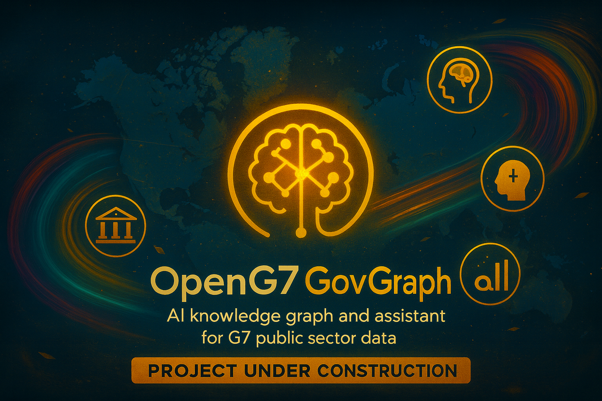

**Languages:** [English](#english) | [Français](#francais)

# 🧠 OpenG7 GovGraph

---

## 🇬🇧 English

**Open knowledge graph and AI assistant for G7 public sector data**

🚧 **Current Status**: Concept & design – initial prototype in preparation  
OpenG7 GovGraph is the **public-sector AI layer** of the OpenG7 ecosystem, designed to help governments of the G7 and the EU explore, understand, and connect their public data.

---

### 🎯 Mission

OpenG7 GovGraph aims to:

- Turn **public sector information** (laws, policies, debates, open data) into an **explainable knowledge graph**.  
- Help **civil servants** find relevant information in seconds instead of hours.  
- Offer **citizens** clear, accessible explanations of complex government programs.  
- Provide a **reusable open-source building block** for responsible AI in governments of the G7 and beyond.

---

### 🧩 What is GovGraph?

GovGraph is an experimental AI-powered platform that:

- Ingests **unstructured documents** (PDFs, notes, parliamentary debates, guidance docs).  
- Connects them with **open data portals** and **economic capacities** mapped by OpenG7.  
- Exposes everything through:
  - **Semantic search & Q&A** for civil servants.  
  - **Plain-language explanations** for citizens.  
  - **APIs** for other government tools.

The long-term goal is to act as a **“digital brain” for public sector data**, while remaining transparent, auditable, and respectful of existing legal frameworks.

---

### 🧠 Example use cases

For **civil servants**:

- Prepare a ministerial briefing by searching across policies, debates, and datasets in one query.  
- Understand how a new law interacts with existing programs and regulations.  
- Quickly explore what **data and capacities** exist on a topic (e.g. green energy, housing, ports).

For **citizens & NGOs**:

- Ask plain-language questions about a right, a program, or a regulation.  
- Discover relevant services, steps, and official resources in a clearer way.  
- See how public commitments connect to real-world capacities (economic, industrial, regional).

---

### 🏛 Relationship to OpenG7 & OpenG20

- **OpenG7**: GovGraph is a **companion project** that focuses on **public sector knowledge** (laws, data, debates) and connects it to the **economic capacities** already mapped in OpenG7.  
- **OpenG20**: Once the G7 layer is mature, the same approach can be extended to G20 economies using OpenG20 as the base.

GovGraph is **not** a replacement for OpenG7/OpenG20 – it is a **specialized AI “lab”** for governments, built on top of them.

---

### 🏗 High-level architecture (draft)

> This section will evolve as the implementation matures.

Planned components:

1. **Connectors**  
   - Small services that fetch and normalize public sector data  
     (open data portals, parliamentary APIs, published policy docs, etc.).

2. **Ingestion & indexing**  
   - Pipelines to:
     - parse text & metadata,  
     - classify topics,  
     - extract entities (laws, programs, sectors, regions),  
     - build the initial graph.

3. **Knowledge graph & embeddings**  
   - Graph structure linking:
     - laws, policies, debates, notes, datasets,  
     - economic capacities from OpenG7 (sectors, provinces, companies).  

4. **AI services**  
   - Semantic search & hybrid retrieval.  
   - Q&A and summarization with **source citations**.  
   - Plain-language rephrasing and accessibility modes.

5. **GovGraph UI & API**  
   - Web interface for civil servants and experimenters.  
   - Public and internal APIs for integration into other tools.

---

### 🧪 Scope for the first prototype

The initial prototype aims to:

- Focus on a **small subset of data sources** (e.g. Canada + 1–2 other G7 partners).  
- Demonstrate:
  - one **end-to-end ingestion pipeline**,  
  - one **semantic search interface**,  
  - one **Q&A + summarization flow with citations**,  
  - one **simple visualization** linking policy → data → capacity.

This first version is mainly intended to support **experiments and demos** (including global challenges such as IAgov).

---

### 🗺 Status & roadmap (high-level)

- [ ] Define the minimal data model for the public sector graph.  
- [ ] Select and document 2–3 initial data sources.  
- [ ] Implement the ingestion & indexing pipeline.  
- [ ] Build the semantic search & Q&A API.  
- [ ] Prototype the web interface (GovGraph Explorer).  
- [ ] Document governance, privacy, and auditability principles.  

Detailed tasks and milestones will be tracked through **issues** and the main **OpenG7 project board**.

---

### 🤝 Contributing

OpenG7 GovGraph follows the same spirit as OpenG7:

- Open source, transparent, and oriented toward the **public good**.  
- Contributions welcome from:
  - developers,  
  - data engineers,  
  - public servants & policy experts,  
  - designers & accessibility specialists.

If you’d like to help:

1. ⭐ Star this repository to show your interest.  
2. Check the **issues** for `good first issue` labels and discussion topics.  
3. Open a **Discussion** if you want to pitch a use case or share domain expertise.  

Before contributing, please:

- Read the future `CONTRIBUTING.md` (coming soon).  
- Follow the security contact described in `SECURITY.md` (once added) for any vulnerability report.

---

### 💸 Sponsors

GovGraph is part of the **OpenG7 ecosystem**.

If you want to support the broader vision (hosting, development time, design, documentation), you can sponsor the organisation via:

- **GitHub Sponsors**: `https://github.com/sponsors/OpenG7`  
- Other options are documented in the main OpenG7 repository.

Your support helps keep this work **independent, open, and focused on the public interest**.

---

### 📜 License

This project is licensed under **MIT**.  
See the `LICENSE` file for full details.

---

## 🇫🇷 Français

**Graphe de connaissances ouvert et assistant IA pour les données publiques du G7**

🚧 **Statut actuel** : Concept & design – prototype initial en préparation  
OpenG7 GovGraph est la **couche IA “secteur public”** de l’écosystème OpenG7, pensée pour aider les gouvernements du G7 et de l’UE à explorer, comprendre et connecter leurs données publiques.

---

### 🎯 Mission

OpenG7 GovGraph vise à :

- Transformer les **informations du secteur public** (lois, politiques, débats, données ouvertes) en un **graphe de connaissances explicable**.  
- Aider les **fonctionnaires** à trouver l’information pertinente en quelques secondes plutôt qu’en quelques heures.  
- Offrir aux **citoyen·ne·s** des explications claires et accessibles sur des programmes complexes.  
- Proposer un **bloc de construction open source** pour une IA responsable au sein des gouvernements du G7 et au-delà.

---

### 🧩 Qu’est-ce que GovGraph ?

GovGraph est une plateforme expérimentale, propulsée par l’IA, qui :

- Ingère des **documents non structurés** (PDF, notes, débats parlementaires, documents d’orientation).  
- Les relie aux **portails de données ouvertes** et aux **capacités économiques** cartographiées par OpenG7.  
- Expose le tout via :
  - une **recherche sémantique et un Q&R** pour les fonctionnaires,  
  - des **explications en langage simple** pour les citoyen·ne·s,  
  - des **API** pour les autres outils gouvernementaux.

L’objectif à long terme est d’agir comme un **« cerveau numérique » des données du secteur public**, tout en restant transparent, auditable et aligné sur les cadres légaux existants.

---

### 🧠 Exemples de cas d’usage

Pour les **fonctionnaires** :

- Préparer une note pour un ministre en cherchant dans les politiques, débats et jeux de données avec une seule requête.  
- Comprendre comment une nouvelle loi interagit avec les programmes et règlements existants.  
- Explorer rapidement quelles **données et capacités** existent sur un sujet (énergie verte, logement, ports, etc.).

Pour les **citoyen·ne·s et les ONG** :

- Poser des questions en langage simple sur un droit, un programme ou un règlement.  
- Découvrir les services pertinents, les étapes à suivre et les ressources officielles.  
- Visualiser comment les engagements publics se connectent à des capacités réelles (économiques, industrielles, régionales).

---

### 🏛 Lien avec OpenG7 et OpenG20

- **OpenG7** : GovGraph est un **projet compagnon** centré sur les **connaissances du secteur public** (lois, données, débats), reliées aux **capacités économiques** d’OpenG7.  
- **OpenG20** : Une fois la couche G7 stabilisée, la même approche pourra être étendue aux économies du G20 en s’appuyant sur OpenG20.

GovGraph **ne remplace pas** OpenG7/OpenG20 : c’est un **laboratoire IA spécialisé pour les gouvernements**, construit par-dessus ces projets.

---

### 🏗 Architecture (brouillon)

> Cette section évoluera avec la mise en œuvre.

Composants prévus :

1. **Connecteurs**  
   - Services chargés de récupérer et normaliser les données du secteur public  
     (portails de données ouvertes, API parlementaires, politiques publiées, etc.).

2. **Ingestion & indexation**  
   - Chaînes de traitement qui :
     - extraient le texte et les métadonnées,  
     - classent les sujets,  
     - identifient les entités (lois, programmes, secteurs, régions),  
     - alimentent le graphe.

3. **Graphe de connaissances & embeddings**  
   - Structure qui relie :
     - lois, politiques, débats, notes, jeux de données,  
     - capacités économiques d’OpenG7 (secteurs, provinces, entreprises).  

4. **Services IA**  
   - Recherche sémantique et recherche hybride.  
   - Q&R et résumés avec **citations des sources**.  
   - Reformulation en langage simple et modes d’accessibilité.

5. **Interface & API GovGraph**  
   - Interface web pour les fonctionnaires et les expérimentations.  
   - API publiques et internes pour l’intégration dans d’autres outils.

---

### 🧪 Portée du premier prototype

Le premier prototype cherchera à :

- Se concentrer sur un **petit ensemble de sources** (par ex. Canada + 1–2 partenaires G7).  
- Démontrer :
  - une **chaîne d’ingestion complète**,  
  - une **interface de recherche sémantique**,  
  - un **flux Q&R + résumé avec citations**,  
  - une **visualisation simple** liant politique → données → capacité.

Cette première version servira surtout à **expérimenter** et à soutenir des **démos** (dont des défis internationaux comme IAgov).

---

### 🗺 Statut & feuille de route (macro)

- [ ] Définir le modèle de données minimal pour le graphe public.  
- [ ] Sélectionner et documenter 2–3 sources initiales.  
- [ ] Implémenter la chaîne d’ingestion & indexation.  
- [ ] Construire l’API de recherche sémantique & Q&R.  
- [ ] Prototyper l’interface web (GovGraph Explorer).  
- [ ] Documenter les principes de gouvernance, de confidentialité et d’auditabilité.  

Les tâches détaillées et jalons seront suivis dans les **issues** et sur le **tableau de projet OpenG7**.

---

### 🤝 Contribution

OpenG7 GovGraph suit l’esprit d’OpenG7 :

- Open source, transparent, orienté vers le **bien commun**.  
- Contributions bienvenues de la part :
  - des développeurs et développeuses,  
  - des spécialistes en données,  
  - des fonctionnaires et expert·e·s en politiques publiques,  
  - des designers et spécialistes de l’accessibilité.

Pour participer :

1. ⭐ Ajoutez une étoile à ce dépôt pour signaler votre intérêt.  
2. Consultez les **issues** (étiquettes `good first issue`, discussions, etc.).  
3. Ouvrez une **Discussion** pour proposer un cas d’usage ou partager votre expertise.

Avant de contribuer, merci de :

- Lire le futur `CONTRIBUTING.md` (à venir).  
- Suivre les indications de `SECURITY.md` (une fois publié) pour tout rapport de vulnérabilité.

---

### 💸 Sponsors

GovGraph fait partie de l’**écosystème OpenG7**.

Pour soutenir la vision globale (hébergement, temps de développement, design, documentation), vous pouvez sponsoriser l’organisation via :

- **GitHub Sponsors** : `https://github.com/sponsors/OpenG7`  

Votre soutien aide à garder ce travail **indépendant, ouvert, et centré sur l’intérêt public**.

---

### 📜 Licence

Ce projet est distribué sous licence **MIT**.  
Consultez le fichier `LICENSE` pour plus de détails.
